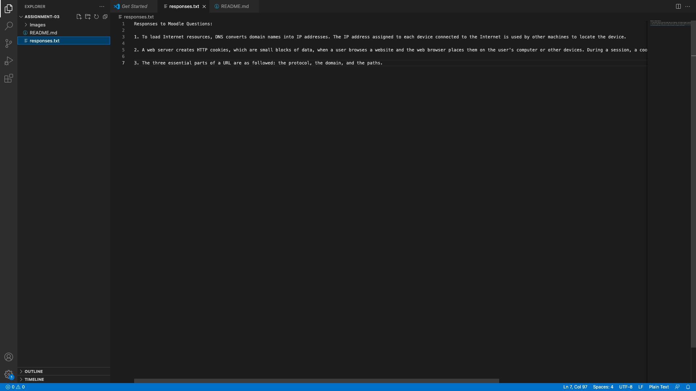

# Heading 1

## Heading 2

### Heading 3

**Responses to Moodle Questions:**

1. I learned that a URL, or a uniform resource locator, has three parts to its anatomy. Those three parts are the protocol, the domain, and the paths. First, the protocol states how the web browser will communicate with a web server. Second, the Domain is a unique name for your website. Finally, the paths are instructions on how to navigate directories.

2. I also learned that HTML, or HyperText Markup Language, helps render web pages or documents designed to be displayed in a browser. On the contrary, I learned that HTTP, or HyperText Transfer Protocol, is a protocol for transfering hypertext from a server to a browser. 

3. In addition to that, I learned the difference between the World Wide Web and the Internet. The Web is the pages you see when you're on an online device, and the Internet is the network of connected computers that the Web works on.

[My GitHub](https://github.com/coltonseymour/web-dev-hw)

[My Responses](./responses.txt)

