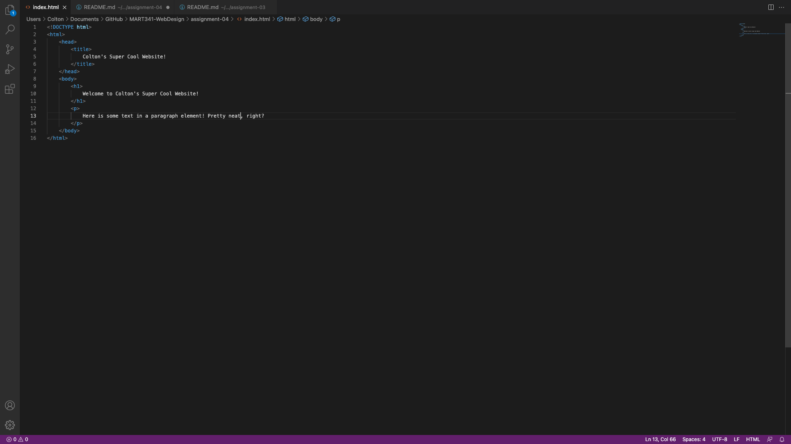

# Responses to Moodle Questions:

1. Web browsers fetch data from the internet via a connected server and uses a rendering engine to translate the data into images and text. All of this is written in HyperText Markup Language, A.K.A., HTML.

2. 