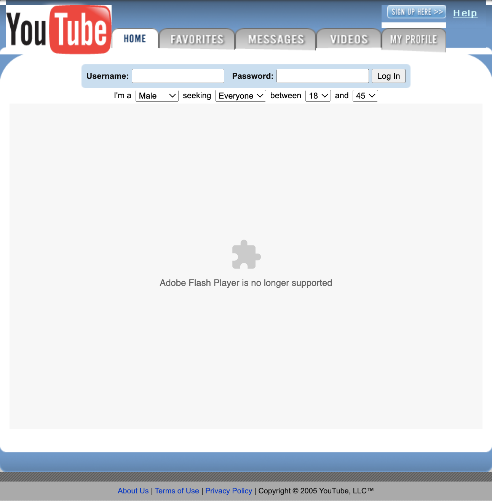
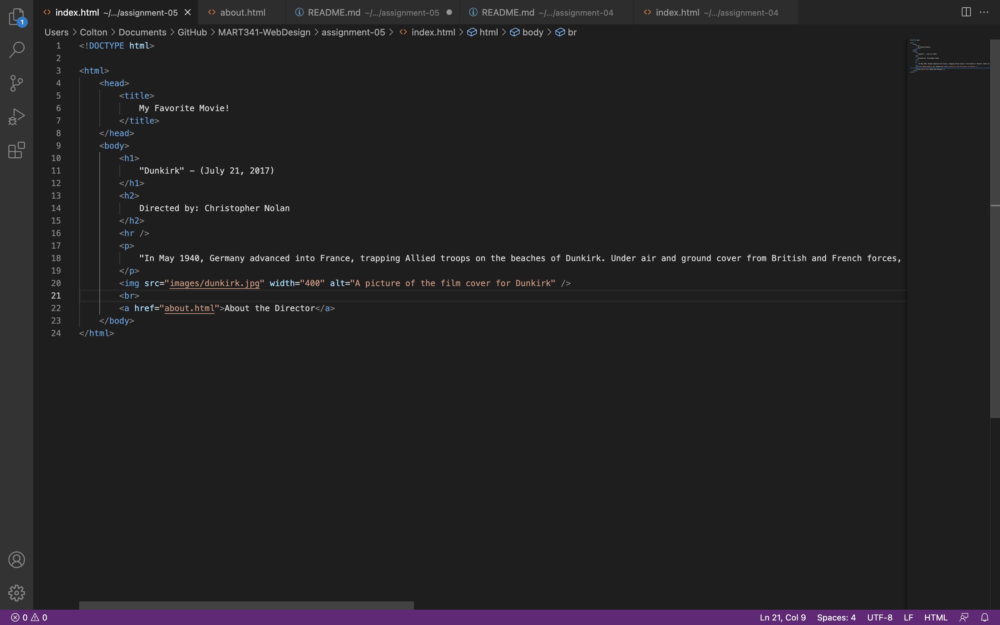

# Response to Moodle Question

1. Using the Wayback Machine, I visited one of my favorite websites: YouTube. The particular year that I decided to visit was 2005. Now, this was before my time on the site, so it was interesting to see how much it has changed. The user interface is completely different than today. In fact, this was back when YouTube was just becoming a thing, so it was quite basic. Back then, things we MUCH simpler. The logo in the top left corner is more or less the same, but has a white background.  The background is a light blue with a white foreground and rounded corners. From there, you can see the home page, your favorites, messages, videos, and profile. Underneath that heading, you have your login. To put it simply, it looks like your stnadard website from the mid-2000s. Overall, I would say that YouTube has come a LONG, LONG way since 2005. 

# Here is a screenshot of YouTube in 2005, if you're curious. 

2. 

# Here is a screenshot of my work.

3. 