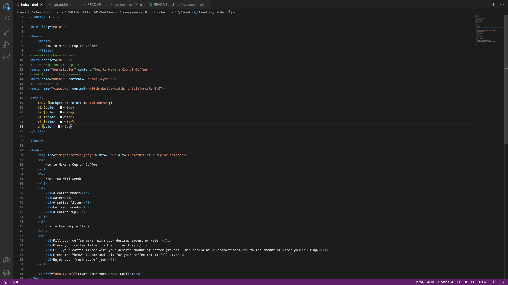

# The difference between semantic and structural markup:

Structural markup is the elements that one can use to describe headings and paragraphs. Meanwhile, sematic markup allows one to structure HTML in order to describe the content's meaning. In other words, sematic markup provides extra information, like emphasis placed in a sentence. 

# A screenshot of my work:

