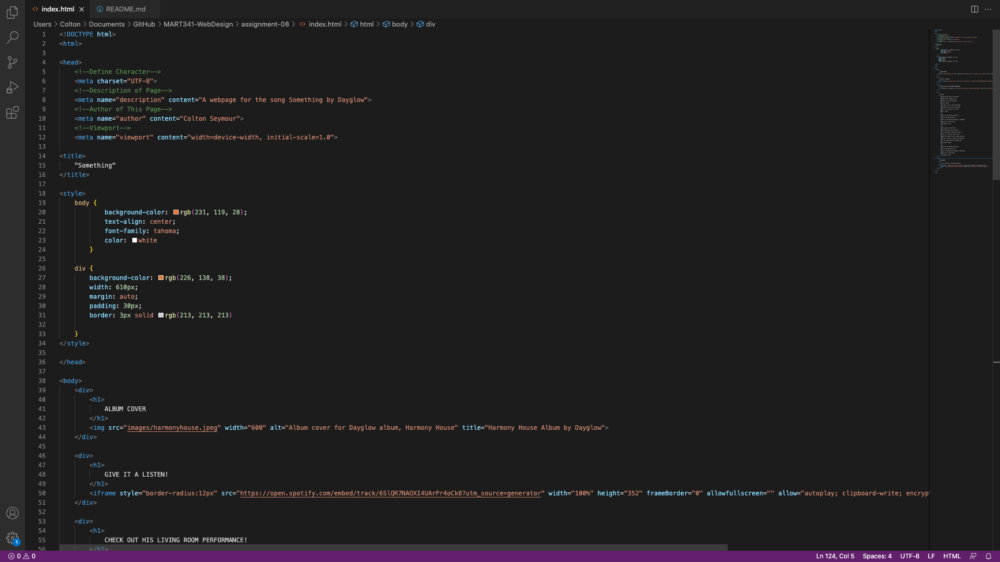

# Moodle Questions

1. Affordances are clues, often some sort of symbol, on a website or user interface that shows how an object is intended to be used. This is normally provided by the object itself or the context surrounding it. The example we learned about in this week's lesson was a coffee cup. Typically, a coffee cup is a vessel for hot liquid, hence the handle. 

2. Using third-party services such as YouTube or Vimeo to host videos has pros and cons. I have listed these below:
    - Pros:
        1. These sites are free and easy to use.
        2. These sites are used my a huge demographic of people, so if you want to get your content out there, this is a quick and easy way to do so. 
        3. Sites like YouTube have monetization, so you can actually make money by hosting your videos on their site.
        4. Videos are easily retrievable with the search function. 
    - Cons:
        1. Customization of videos is limmited.
        2. You may not have to deal with negative comments, unless you have a feadback form.

# Screenshot

