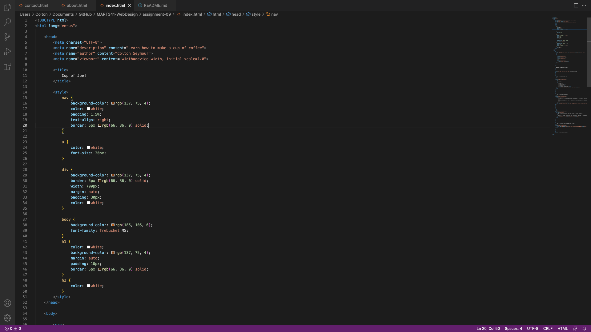

# Moodle Questions:

1. I have really enjoyed my experiences learning HTML. I took Creative Coding I last year, so I dove into HTML a little bit, but not quite like this. In fact, Creative Coding mostly focused on JavaScript, so this has been a nice change of pace. So far, it hasn't really been that difficult to learn. Everything is fairly straight-forward. That being said, we are just brushing the tip of the iceberg, so I am excited to see what will come next!

2. I am very excited to dive into CSS. CSS is what the "design" portion of this class is all about! I'm looking forward to learning new ways to make my websites look appealing to visitors. From what I understand, there is SO much you can do with CSS, so I'm ecstatic to jump right in. 

# Screenshot:

