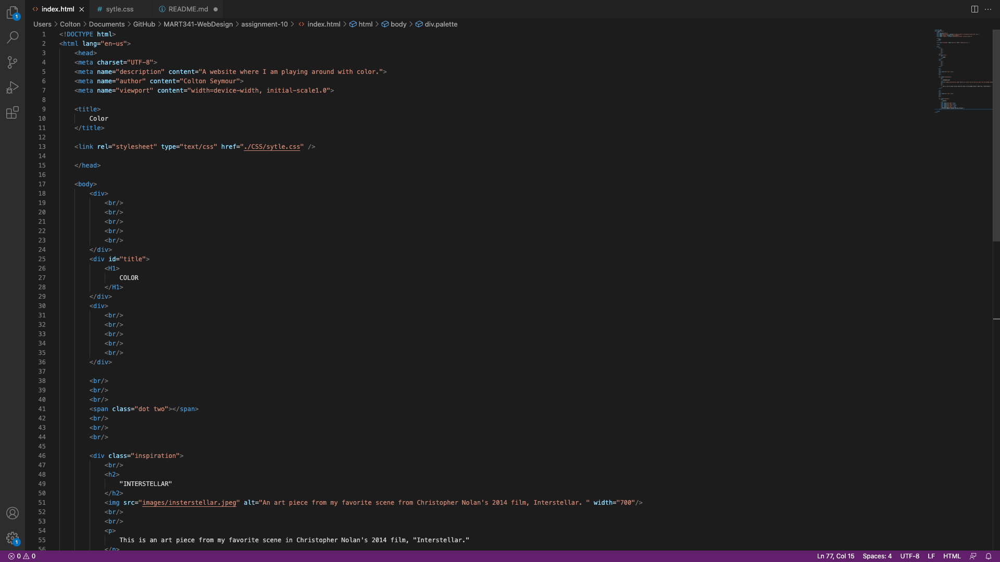

# Moodle Questions:

1. An ID is utilized to uniquely identify just one element in our HTML, as opposed to a class, which is how they differ from one another. IDs are only employed when a specific style should be applied to a single element on the page. That being said, more than one HTML element can be identified using a class.

2. I found the art piece that I used in this week's website on Reddit. This is my favorite scene from Interstellar. I love how the colors and shapes in the photo work together to create an imitation of what we could only imagine is the fourth demension. To achieve the actual color palette that I used, I used a website that allows you to turn an image into a color scheme and then download it as an image, which also included the HEX codes. 

# Screenshot

