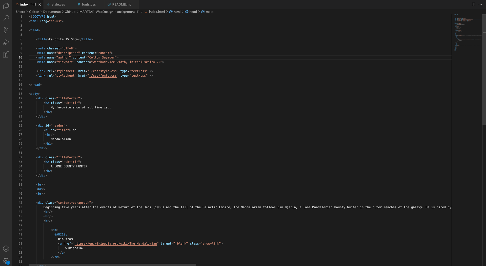

# Moodle Questions:

1. In typography, the arrangement of type is done to make written language legible, readable, and visually appealing.

2. A generic font family provides a fallback mechanism, allowing us to specify a list of look-alike fonts, so the browser can select the second font if the first one is not available.

3. A system font is one that's already available on most devices, so you don't have to download a web font. Meanwhile, a web-font is one that is available for users to download through web-services, such as Google, Adobe, DaFont, etc. On the other hand, a web-safe font, which is similar to a system font, are fonts that come pre-installed on the majority of devices.

# Screenshot:

