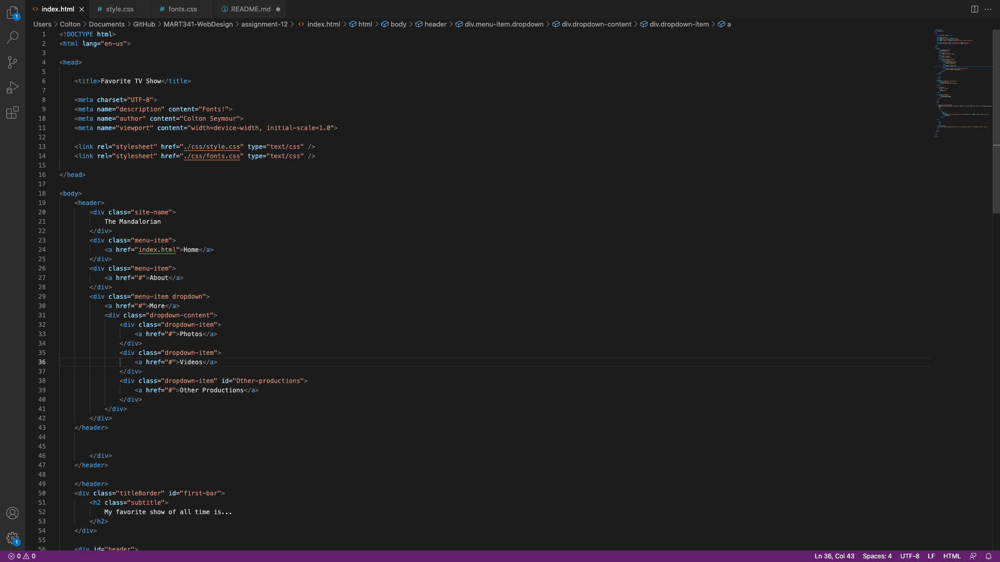

# Moodle Quesitons:

1. First off, padding is the inner space between one's content and the border of one's box. Second, margin is the space outside of one's box. And third, border is the perimeter of one's box, which can either be vidible, or invisible. 

# Screenshot:

