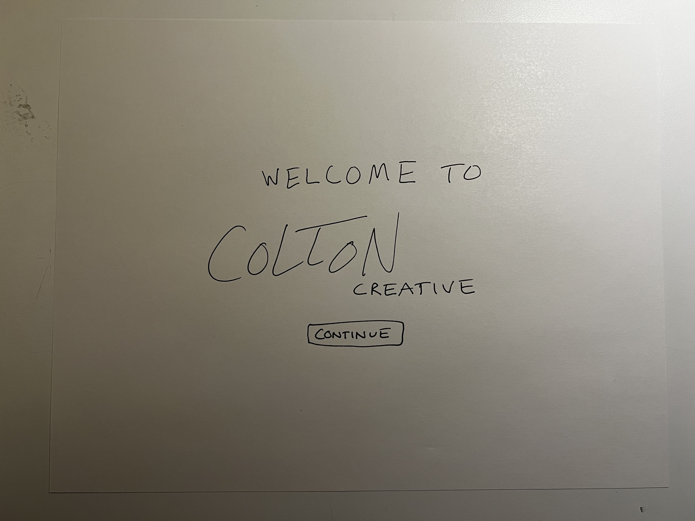
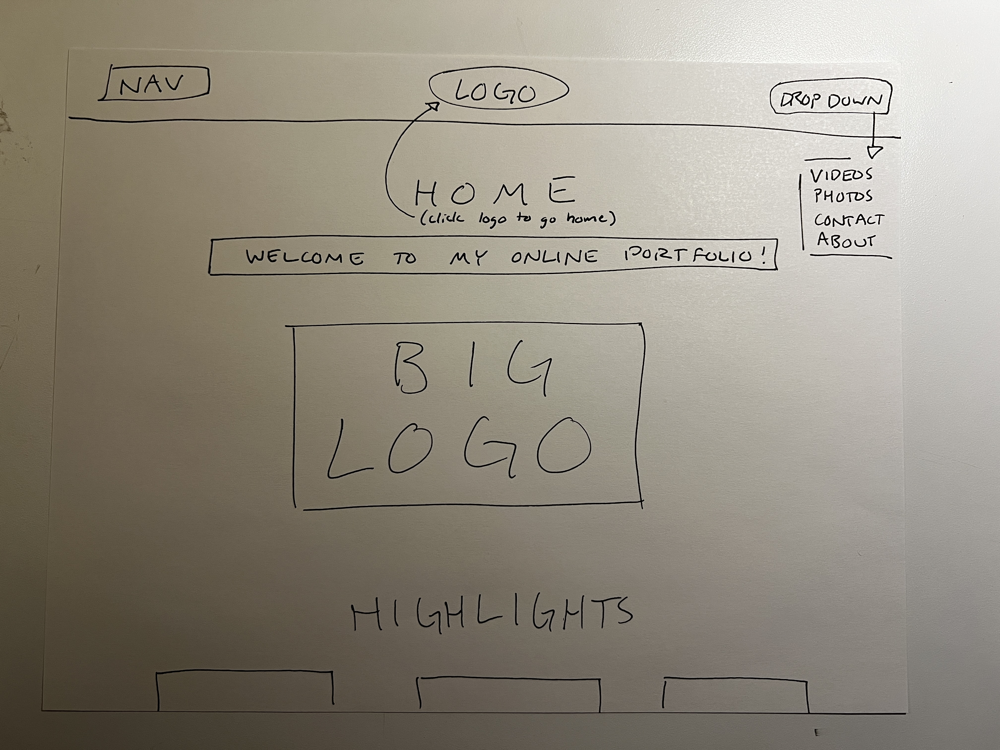
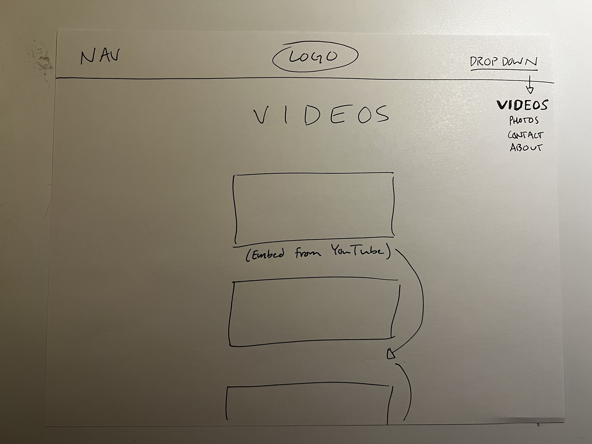
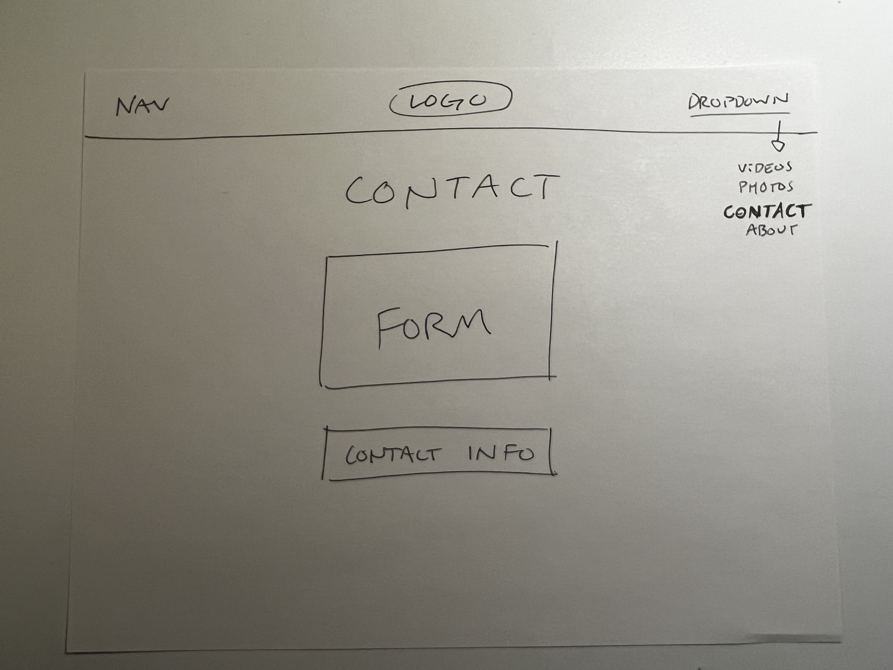
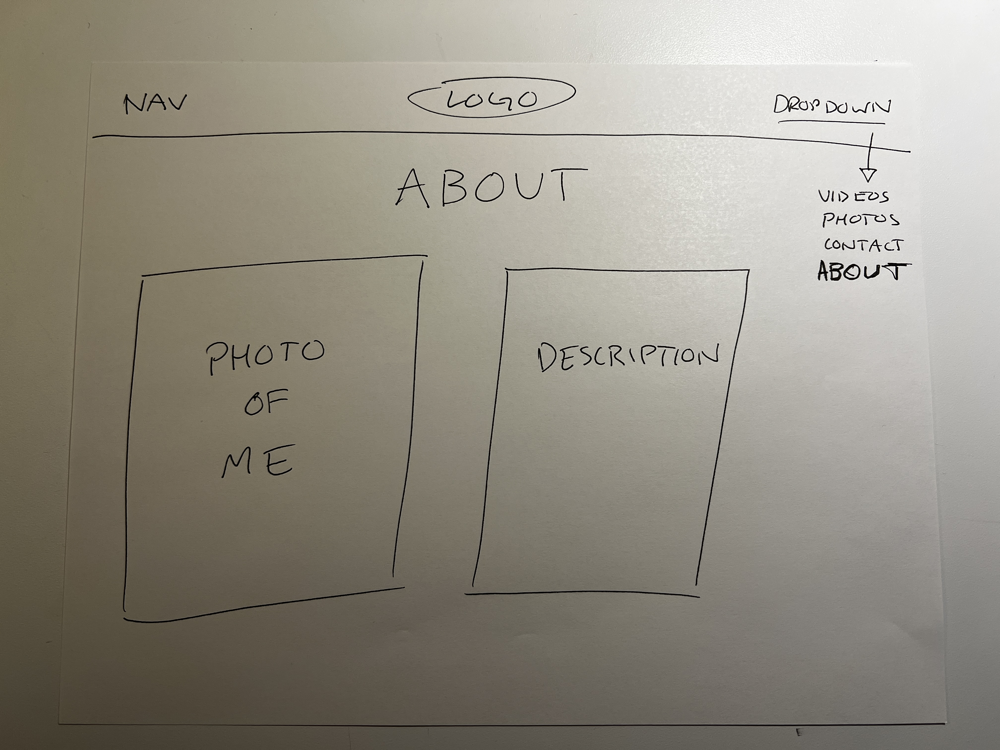

# Moodle Questions

1. The goal of my website is to showcase some of the work that I have done here at UM in a portfolio format. I want to make sure that it is interesting, engaging, easy to navigate, and easy to use. 
2. When you use responsive web design for your website, you ensure that the content of your site flows smoothly across all screen sizes and resolutions. In addition, the website looks good on all devices.

# Wireframes:

